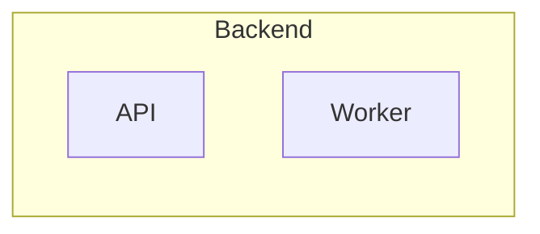

# Mermaid Authoring

Используй этот файл для выбора типа Mermaid-диаграммы, устойчивого синтаксиса и
компоновки, которую можно проверить PNG-рендером.

## Выбор типа

| Сценарий | Тип Mermaid | Правило |
|---|---|---|
| Процесс, пользовательский путь, пайплайн, архитектурный поток | `flowchart LR` или `flowchart TB` | Начинай с направления чтения, затем группируй `subgraph` |
| Диалог сервисов, API, события во времени | `sequenceDiagram` | Указывай `participant`, короткие сообщения и, когда полезно, `autonumber` |
| Состояния продукта, заказа, автомата | `stateDiagram-v2` | Используй стабильные ID состояний и короткие transition labels |
| Доменные сущности и связи | `erDiagram` или `classDiagram` | Выбирай ER для данных, class для типов и методов |
| План-график | `gantt` или `timeline` | Проверяй даты и группировку, потому что ошибки часто видны только в PNG |
| Иерархия тем или дерево решений | `mindmap` или `flowchart TB` | Если renderer ломает `mindmap`, переходи на `flowchart TB` |
| C4 или architecture-beta | Только если renderer поддерживает | При сбое делай обычный `flowchart` с тем же смыслом |

## Устойчивый синтаксис

- Один файл - одна Mermaid-диаграмма.
- Начинай файл с явного типа: `flowchart LR`, `sequenceDiagram`,
  `stateDiagram-v2`, `classDiagram`, `erDiagram`, `gantt`, `timeline` или
  `mindmap`.
- Для `flowchart` предпочитай стабильные ASCII-ID: `api_gateway`,
  `billing_service`, `review_queue`.
- Подписи с пробелами, пунктуацией, скобками или двоеточиями заключай в
  кавычки: `api_gateway["API Gateway rate limits"]`.
- Для переноса строк внутри узла используй ` `, а не длинные абзацы.
- Избегай Markdown-списков, HTML-таблиц, emoji и сложной HTML-разметки внутри
  узлов. Browserless renderer работает с `htmlLabels: false`, поэтому диаграмма
  должна быть читаемой как SVG text, без `foreignObject`.
- Для edge labels в `flowchart` держи текст коротким:
  `a -->|"valid token"| b`.
- В `subgraph` называй группу человеческой подписью, а внутренние ID оставляй
  техническими:

## Компоновка

- Выбери `LR`, когда есть поток слева направо, pipeline, архитектура или
  sequence-like обзор.
- Выбери `TB`, когда важна иерархия, дерево решений, этапы сверху вниз или
  учебная схема.
- Держи 5-9 основных элементов в одном визуальном ряду. Если получается больше,
  раздели диаграмму на обзор и детали.
- Сначала группируй смысловые зоны, потом соединяй группы. Не добавляй ребра
  через все полотно, если можно ввести промежуточный узел или отдельную
  диаграмму деталей.
- Возвратные петли и исключения подписывай явно, чтобы они не выглядели как
  основной путь.
- Для документации и презентаций предпочитай короткие существительные в узлах и
  глаголы на стрелках.

## Перед рендером

Проверь исходник глазами до запуска renderer:

- тип Mermaid указан один раз в начале;
- все ID объявлены до сложных связей или легко читаются из строки;
- нет случайных `|`, кавычек или двоеточий внутри неподписанных labels;
- длинные подписи разбиты через ` `;
- диаграмма не пытается одновременно быть обзором, детализацией и таблицей.
